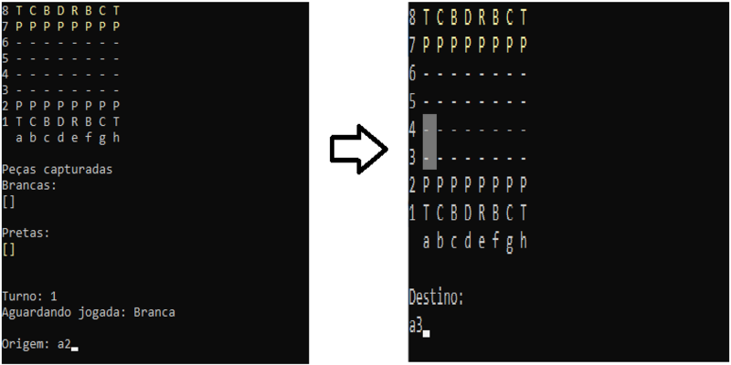

## Xadrez em C#
Este é um projeto de implementação do jogo de xadrez em C# utilizando o paradigma de orientação a objetos. O jogo foi desenvolvido como parte de um exercício para praticar conceitos de programação e estruturas de dados.

## Tecnologias
Aqui estão as tecnologias usadas no projeto.

* C# version  6.0

## Serviços usados

* GitHub

## Funcionalidades

* Movimentação das peças de acordo com as regras do xadrez.
* Captura de peças adversárias.
* Promoção do peão para dama quando ele alcança a última linha do tabuleiro.
* Roque (movimento especial do rei combinado com a torre) quando as condições são atendidas.

## Como jogar

* Para jogar o xadrez, basta executar o programa e seguir as instruções exibidas no console.
* Os movimentos das peças são inseridos no formato de coordenadas do xadrez (ex: "a2 a4", "e7 e5").
* O jogo exibe o tabuleiro atualizado após cada jogada e informa sobre possíveis xeques ou xeques-mates.

## Autor

  * **Leonardo Almeida** 

  Me siga no GitHub! Obrigado por visitar!
